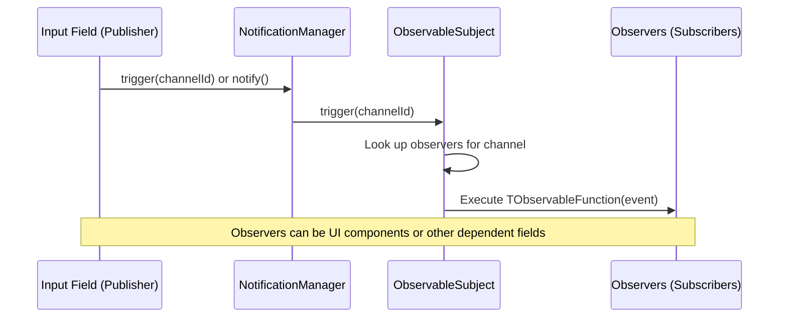

# Channel-Based Messaging System Architecture

The `formular.dev` project utilizes a robust Pub/Sub event flow built around a channel-based messaging system. This allows for fine-grained reactivity where components can listen to either form-wide events or specific field-level updates.

## Core Components

### 1. NotificationManager
The `NotificationManager` (`src/core/managers/notification-manager/`) acts as the central event bus. It processes notifications, supports batching (`batchNotify`), debouncing (`debounceNotify`), and extensions. It holds an instance of `ObservableSubject` which manages the actual subscription mappings.

### 2. ObservableSubject
The `ObservableSubject` (`src/core/observers/observable-subject/`) handles the underlying Pub/Sub mechanism. It maintains a mapping of string-based channels to their corresponding observers:
- **Channels**: Represents an event scope, typically a field ID (e.g., `'field_first_name'`) or `undefined` for form-wide events.
- **Observers**: Stored as both `strong` (standard arrays) and `weak` references (via `FinalizationRegistry`) to prevent memory leaks in dynamic forms.

## Pub/Sub Event Flow

When an input value changes or a validation event occurs, the system routes the event through the following flow:

## Advanced Behaviors

- **Debouncing**: `debounceNotify` creates a unique key per `type:channel`, allowing independent debouncing per field.
- **Batching**: The notification manager can schedule batches (`scheduleBatch`, `processBatch`) grouped by event types or priority queues to minimize redundant UI renders.
